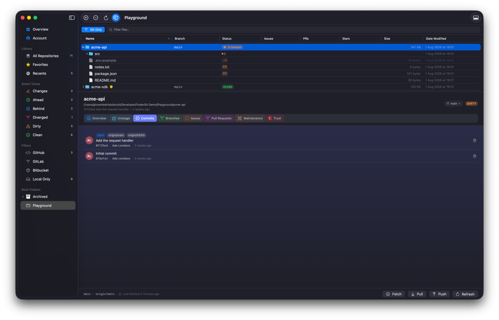

<p align="center">
  
</p>

<h1 align="center">FinderGit</h1>

<p align="center">
  <strong>A Git-aware file browser for macOS.</strong><br/>
  Finder-style list view, real-time Git status, inline diffs, full git actions — all in one window.
</p>

<p align="center">
  <a href="https://github.com/gfazioli/findergit-website/releases/latest"></a>
  <a href="https://www.apple.com/macos/"></a>
  <a href="LICENSE"></a>
</p>

<p align="center">
  <a href="https://findergit.app">Website</a>
  ·
  <a href="https://findergit.app/docs/getting-started">Documentation</a>
  ·
  <a href="https://github.com/gfazioli/findergit-website/releases/latest">Download</a>
</p>

<p align="center">
  
</p>

## What is FinderGit?

FinderGit is a native macOS app that combines file browsing with Git intelligence. Instead of switching between Finder and a Git client, you get everything in one window:

- **Tree view with columns** — browse files like Finder's list view, with sortable columns for Branch, Status, Changes, Size, and Date Modified
- **Live Git status** — every repository shows its branch, clean/dirty/unpushed state, and number of changed files, updated in real time via FSEvents
- **Ahead/behind counter** — the status badge shows `↑N`, `↓N`, or `↑N ↓M` so you can spot repos that need a push, a pull, or both at a glance
- **Auto-fetch** — optional background `git fetch` at a user-chosen interval to keep the ahead/behind counter fresh
- **Diff viewer** — click any modified file to see a colored inline diff
- **Git actions** — stage, unstage, commit, push, pull, fetch, branch switch, all from the UI
- **Repo Trust — supply-chain safety** — surface a repo's *auto-run surface* (editor tasks, AI-agent configs, dev-container and npm hooks) and get alerted when it changes after a pull. FinderGit also detects the committed **dropper** behind supply-chain worms like **Shai-Hulud / Miasma** — the obfuscated `.github/setup.js`-style payload — across *every* branch, not just the checkout, and never runs anything it finds. When a repo looks compromised it shows an incident runbook: revoke the OAuth authorization, then reset (not revert) the infected branches
- **Repo Maintenance** — a per-repo disk-usage breakdown and one-click cleanup (Optimize / Deep Clean) to reclaim Git space, with a sortable Size column in the browser
- **Native Markdown preview** — press Space on any `.md` file for a rendered preview
- **Smart context menus** — adapts to whether you're on a regular file, a tracked file, or a repository
- **Multiple root folders** — add as many as you want; drop folders from the macOS Finder into the sidebar to add them as roots
- **Universal binary** — one DMG runs on Apple Silicon and Intel Macs
- **Auto-updates** — built in via Sparkle

## Download

[**→ Download the latest version**](https://github.com/gfazioli/findergit-website/releases/latest)

After downloading, open the DMG and drag FinderGit into your Applications folder. Launch it normally — the app is signed with Apple Developer ID and notarized by Apple, so Gatekeeper accepts it on first open.

## Requirements

- macOS 15 Sequoia or later
- Xcode Command Line Tools (FinderGit uses the system `git` binary). On a fresh Mac, run once:
  ```bash
  xcode-select --install
  sudo xcodebuild -license
  ```
- Repositories that use [Git LFS](https://git-lfs.com) need `git-lfs` installed (`brew install git-lfs && git lfs install`). FinderGit detects when it's missing and tells you exactly how to fix it instead of failing silently.

## Documentation

Full documentation, screenshots and FAQ at **[findergit.app](https://findergit.app)**.

## About this repository

This repo hosts the **marketing site** and **release downloads** for FinderGit. The app source lives in a separate repository.

The site is built with [Next.js 16](https://nextjs.org/), [Mantine 9](https://mantine.dev/) and [Nextra 4](https://nextra.site/).

### Local development

```bash
yarn install
yarn dev
```

Then visit [http://localhost:3000](http://localhost:3000).

## License

MIT
